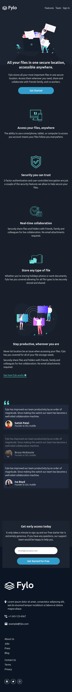

# Frontend Mentor - Fylo dark theme landing page solution

## Table of Contents

- [Overview](#overview)
  - [The Challenge](#the-challenge)
  - [Screenshot](#screenshot)
  - [Links](#links)
- [My Process](#my-process)
  - [Technologies Used](#technologies-used)
  - [Form Validation](#form-validation)
- [Acknowledgments](#acknowledgments)
- [Author](#author)

## Overview

### The Challenge

This is my solution to the [Fylo dark theme landing page challenge on Frontend Mentor](https://www.frontendmentor.io/challenges/fylo-dark-theme-landing-page-5ca5f0ef1e82137ec91a50fa).

The challenge was to build a landing page for a fictional company called Fylo, using the provided design files in Figma. The landing page had to be fully responsive and pixel-perfect, matching the design as closely as possible.

### Screenshot

### Links

- [Live Site](https://your-live-site-url.com)

## My Process

I decided to build the landing page using ReactJS and TailwindCSS, as I am familiar with both technologies and I wanted to use this opportunity to improve my skills. To get started, I set up the project using create-react-app and installed the necessary dependencies, including TailwindCSS and ionicons for the icons.

I then proceeded to build the different components of the landing page, following the design as closely as possible and making sure that everything was fully responsive and looked great on all screen sizes. I used TailwindCSS extensively for the styling, taking advantage of its utility classes to quickly and easily style my components.

### Technologies Used

- ReactJS
- TailwindCSS
- Ionicons

### Form Validation

One of the requirements of the challenge was to perform form validation on the email input field. To accomplish this, I used the built-in HTML5 validation attributes, along with some custom JavaScript code to handle the validation logic.

When the user submits the form, the JavaScript code checks if the email is valid and displays an error message if it is not. If the email is valid, the form is submitted as usual.

## Acknowledgments

I would like to thank Frontend Mentor for providing this challenging and fun project, as well as all the resources and support needed to complete it successfully. I also want to thank the open-source community for providing the tools and technologies that made this project possible.

## Author

### Evans Elabo

- GitHub: [evanselabo](https://github.com/evanselabo)
- LinkedIn: [Evans Elabo](https://www.linkedin.com/in/evanselabo/)
- Twitter: [@evanselabo](https://twitter.com/evanselabo)
